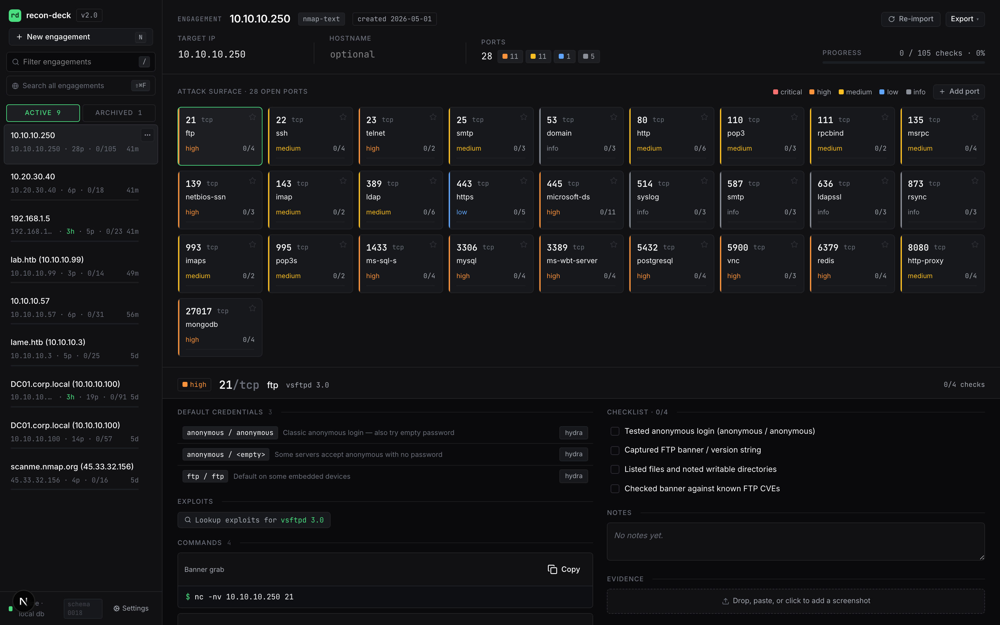

<div align="center">

# 🛰️ recon-deck

**From `nmap` output to an actionable, port-aware recon checklist in under 30 seconds.**
Offline. Self-hosted. Every engagement export-ready as Markdown.

[](LICENSE)
[](CHANGELOG.md)
[](src/lib/db/migrations/)
[](https://github.com/kocaemre/recon-deck/pkgs/container/recon-deck)
[](https://nextjs.org)
[](SECURITY.md)

</div>

---

Paste nmap text / XML / greppable output — or drag in an AutoRecon `results/` zip — and every open port becomes a card with pre-filled commands (IP interpolated), HackTricks links, tickable checks, evidence screenshots, and a notes field.

Built for **OSCP / HTB students and solo pentesters** who currently juggle 8 browser tabs and a scratch Obsidian file per box.

<div align="center">

[](https://youtu.be/bZP_6gsokFQ)

<sub><i>▶ <a href="https://youtu.be/bZP_6gsokFQ">Watch the 50-second demo</a> — paste nmap → drill into a port → tick checks → switch ports.</i></sub>

<br><br>

  
  <br>
  <sub><i>An engagement view: 28 open ports, KB-matched risk colors, per-port check completion. <a href="docs/screenshots/">More screenshots →</a></i></sub>
</div>

<br>

```bash
# 30-second smoke test — pulls the image, starts on http://localhost:13337
curl -sSL https://raw.githubusercontent.com/kocaemre/recon-deck/main/install.sh | sh
```

---

## Why recon-deck

| Without it | With it |
|---|---|
| 8 browser tabs per box (HackTricks, payloadsallthethings, gtfobins, …) | One page per port, prefilled commands ready to copy |
| Hand-typing `nmap -p- -sV` boilerplate per service | KB-driven commands with `{IP}` / `{HOST}` / `{PORT}` / `{WORDLIST_*}` placeholders |
| Lost track of which checks you ran on box #7 | Tickable checklist + per-port notes saved in SQLite |
| Markdown report = manual copy-paste from notes | One-click export: Markdown / HTML / JSON / SysReptor / PwnDoc / PDF |
| AutoRecon dump → folder spelunking | Drop the zip, every per-port file routed to the right card |

---

## Feature highlights

<details>
<summary><b>📥 Ingest</b> — nmap text / XML / greppable + AutoRecon zip + manual ports</summary>

- **Multi-format nmap parser** — `-oN`, `-oX`, `-oG`. Multi-host scans become a host-selector chip in the header
- **AutoRecon zip import** — drag the `results/` folder zipped; per-port service files, `_manual_commands.txt`, gowitness screenshots, patterns / errors logs all routed automatically
- **Re-import + diff** — re-paste a fresh nmap output and the heatmap badges new ports `NEW` and previously-open ports `CLOSED`. Header `scans: N` chip tracks how many imports you've done
- **Manual ports** — heatmap `+ Add port` for services nmap missed (DNS zone transfer, alt banners, etc.)

</details>

<details>
<summary><b>🎯 Triage</b> — KB-driven port cards, known-vulns, searchsploit, findings catalog</summary>

- **KB-driven cards** — port + service + product/version match shipped YAML KB → tickable checks, prefilled commands, HackTricks links
- **Active Directory toolkit** — `nxc` (netexec), impacket (`GetNPUsers`, `GetUserSPNs`, `secretsdump`), kerbrute, bloodhound-python, PetitPotam, pyWhisker — all wired to the right DC ports (88/135/389/445/464/636/3268/3389/5985)
- **Known-vulns auto-match** — `vsFTPd 2.3.4` and friends → vuln + CVE + ref link surfaces on the port card
- **searchsploit lookup** — one-click `searchsploit -t "<product>"` per port, cached
- **Findings catalog** — severity / title / description / CVE / evidence refs. One-click `+ finding` button on KB rows pre-populates the modal

</details>

<details>
<summary><b>🖼️ Evidence</b> — per-port screenshots, AutoRecon gowitness import, native annotation</summary>

- **Drag-drop / clipboard-paste** screenshots into a per-port evidence pane
- **Native HTML5 canvas annotation** — Box / Arrow / Pencil / Text tools, 5-color palette, undo stack. Save chains a new evidence row via `parent_evidence_id` so the original always survives
- **AutoRecon gowitness / aquatone PNGs** auto-import into the matching port's evidence list

</details>

<details>
<summary><b>📤 Export</b> — Markdown, JSON, HTML, CSV, SysReptor, PwnDoc, print-to-PDF</summary>

- **Six export formats** plus a print-optimised PDF route
- **Markdown** ships with Obsidian-compatible frontmatter
- **SysReptor JSON** + **PwnDoc YAML** for reporting-tool feeds
- **Findings CSV** for spreadsheet triage
- **Multi-host aware** — SysReptor scope and PwnDoc scope list every host; markdown / HTML render one section per host

</details>

<details>
<summary><b>⌨️ Workflow</b> — command palette, FTS5 search, keyboard shortcuts, sidebar actions</summary>

- **Command palette** (`⌘K`) — every UI action lives in the palette: add finding, re-import, settings, delete, exports, print
- **Cross-engagement search** (`⌃⇧F`) — FTS5 + BM25, hit rows show host context
- **Sidebar engagement actions** — hover-kebab with rename / duplicate (deep-copy) / delete (shadcn AlertDialog)
- **Custom commands** + **wordlist overrides** at `/settings/commands` and `/settings/wordlists` — your snippets surface alongside KB commands

</details>

<details>
<summary><b>📚 Knowledge base</b> — YAML KB, in-app editor, hot-reload</summary>

- **YAML KB** — drop entries in `/kb` (or wherever you point `kb_user_dir`); shipped KB lives under `knowledge/`
- **In-app editor** at `/settings/kb` — paste, validate against the Zod `KbEntrySchema`, save under a strict filename allowlist
- **Hot reload** — `fs.watch` on shipped + user dirs flips a dirty flag, next request rebuilds. Edit a YAML in your editor, refresh, see your change
- **In-app editor** at `/settings/kb` — paste, validate, save (atomic write under a strict `[A-Za-z0-9_-]` filename allowlist)

</details>

<details>
<summary><b>🛡️ Safety</b> — migration backup, host-header allowlist, rate limiter, offline-by-default</summary>

- **Pre-migration snapshots** via `VACUUM INTO` — boot writes `data/recon-deck.db.backup-pre-NNNN` before any new migration runs. Failure logs surface a copy-pasteable `cp` rollback line
- **Post-migration `PRAGMA integrity_check` + `foreign_key_check`** — either failing aborts boot
- **Host-header allowlist middleware** — defends DNS-rebinding when the app is reachable on `0.0.0.0`
- **Per-IP rate limiter** on `/api/*` — defense-in-depth for the LAN-exposure case
- **Offline by default** — zero outbound HTTP unless the operator opts in to the GitHub release check

</details>

<details>
<summary><b>🚀 First-run</b> (v2.1.0) — onboarding, sample engagement, update toast</summary>

- **`/welcome` 4-step onboarding** — scope · tour · local paths · updates. Seeds the `app_state` singleton with your `local_export_dir`, `kb_user_dir`, `wordlist_base`, and the release-check toggle
- **Replay onboarding** from `/settings → First-run` — paths preserved
- **Sample engagement** — "Try sample" on the paste panel inserts a canned 10-port HTB-easy box marked `is_sample = true`. Header surfaces a `SAMPLE` chip + single-click Discard
- **Notify-only update check** (opt-in) — pings `api.github.com/repos/kocaemre/recon-deck/releases/latest` once per session, toasts a "Release notes" link if a newer tag exists. Installs stay manual
- **Desktop-only viewport guard** — `< 1280px` shows a clean "needs a wider screen" explainer

</details>

---

## Quick Start

Three ways to run, pick one. All bind to `127.0.0.1:13337` (port picked to dodge the dev-server crowd on 3000/8080), so nothing leaks to your LAN by default; see [Exposing to LAN](#exposing-to-lan) if you need otherwise.

**1. One-liner (auto-pulls + starts + opens browser):**

```bash
curl -sSL https://raw.githubusercontent.com/kocaemre/recon-deck/main/install.sh | sh
```

**2. Docker Compose (recommended for persistent setups):**

```bash
curl -O https://raw.githubusercontent.com/kocaemre/recon-deck/main/docker-compose.yml
docker compose up -d
```

**3. Manual `docker run`:**

```bash
docker run -d --name recon-deck -p 127.0.0.1:13337:13337 \
  -v recondeck-data:/data \
  -v recondeck-kb:/kb \
  -e HOSTNAME=0.0.0.0 \
  ghcr.io/kocaemre/recon-deck
```

Open <http://localhost:13337>, paste nmap output, see cards. The `-p 127.0.0.1:13337:13337` host-side prefix keeps the app loopback-only — see [Exposing to LAN](#exposing-to-lan) for LAN reachability.

### Beta channel (early builds)

Stable is the default. To try the newest pre-release build (new features land here first; may be unstable):

```bash
# One-liner
curl -sSL https://raw.githubusercontent.com/kocaemre/recon-deck/main/install.sh | sh -s -- --beta

# or pull the beta image directly
docker pull ghcr.io/kocaemre/recon-deck:beta
```

Image tags: `:latest` and `:X.Y.Z` are stable; `:beta` always points at the newest pre-release, and each beta is also pinned at `:X.Y.Z-beta.N`. Switch back to stable any time with `--stable` (or pull `:latest`). To have the in-app update toast track betas, set `RECON_UPDATE_CHANNEL=beta` (otherwise it only ever surfaces stable releases).

---

## What it is / What it is NOT

**For OSCP/HTB students and solo pentesters.** Offline. No LLM. Does not run scans — it complements AutoRecon and HackTricks. Think of it as the OSCP-flavored Obsidian for recon: same category as Obsidian, focused on post-scan workflow.

**It is NOT** a reporting platform, a team tool, a scanner, an AI assistant, or a mobile app. The intent is deliberate and narrow — see [ROADMAP.md](ROADMAP.md) for the out-of-scope list.

---

## Exposing to LAN

By default, the Quick Start binds to `127.0.0.1` on the host — only your local machine can reach the app. To make recon-deck reachable from another machine on your LAN:

```bash
docker run -p 13337:13337 \
  -v recondeck-data:/data \
  -v recondeck-kb:/kb \
  -e HOSTNAME=0.0.0.0 \
  -e RECON_DECK_TRUSTED_HOSTS=192.168.1.10:13337 \
  ghcr.io/kocaemre/recon-deck
```

Replace `192.168.1.10:13337` with the host:port your LAN clients will use. `RECON_DECK_TRUSTED_HOSTS` is comma-separated — expand it for every additional host you want to reach the app from.

This activates the host-header allowlist (mitigates DNS rebinding). Requests whose `Host:` header is not in the allowlist are rejected with HTTP 421 Misdirected Request. See [SECURITY.md](SECURITY.md) for the full threat model.

---

## Customizing the Knowledge Base

Drop YAML files into `/kb/ports/*.yaml` (volume-mounted) — they override shipped entries with the same port/service at startup. Schema, denylist, and placeholder syntax in [CONTRIBUTING.md](CONTRIBUTING.md).

Bind-mounting a host dir? Container runs as UID 1000 — `chown 1000:1000 /path/to/my-kb` first, or use a named volume (`-v recondeck-kb:/kb`) which inherits ownership automatically.

---

## AutoRecon Import

1. `autorecon <target>` → produces `results/<ip>/`
2. `cd results && zip -r my-target.zip <ip>/`
3. Drag the zip onto the import panel

Server-side unzip routes everything: per-port files (`tcp80/…`, `tcp_22_ssh_*`) into the right card, `_manual_commands.txt` into Manual commands, gowitness/aquatone PNGs into port evidence, log files (`_patterns`, `_errors`, `_commands`) into an engagement warning panel. Multi-IP zips become multi-host engagements (primary inherits full AR data, secondaries get ports + scripts).

---

## Multi-host engagements

One engagement, N hosts (DC + workstations, related boxes, etc.). Hosts chip-switch in the header; heatmap + commands + palette all rescope. Multi-host is detected from XML `<host>` blocks, text/greppable `Nmap scan report for ...` boundaries, and AutoRecon multi-IP zips.

---

## Re-import + scan diff

Hit **Re-import** in the engagement header and paste a fresh nmap output. The reconciler:

- Adds new ports (`NEW` chip on the heatmap)
- Refreshes `last_seen_scan_id` for re-observed ports
- Marks ports the new scan didn't see as `closed` (`CLOSED` chip, dim tile)
- Surfaces a `scans: N` chip in the header so you know multi-import diff context applies
- Toast: `1 new · 1 closed · 2 unchanged` after import

---

## Settings

`/settings` (footer link in the sidebar) covers:

- **Engagement list** — inline delete with cascade confirmation
- **Wordlists** (`/settings/wordlists`) — override `{WORDLIST_*}` placeholders
- **Custom commands** (`/settings/commands`) — personal snippets alongside KB commands, scopable by service/port
- **KB editor** (`/settings/kb`) — paste, validate, save to your user dir; cache invalidates immediately

Engagement renames are inline on the header (target identity) or via the sidebar kebab (display label). The kebab also exposes Duplicate (deep-copy transaction) and Delete (cascade with confirmation).

---

## Exports

Six formats + a print route. All multi-host aware.

| Format | Use |
|---|---|
| **Markdown** | Obsidian-compatible frontmatter, paste into your vault |
| **JSON** | Structured dump for scripting |
| **HTML** | Standalone single-file report, opens offline |
| **Findings CSV** | Severity / host / port / CVE rows for spreadsheets |
| **SysReptor JSON** | `projects/v1` shape with `scope[]` |
| **PwnDoc YAML** | Findings + scope, multi-host aware |
| **Print-to-PDF** | `/report` route, Ctrl+P → Save as PDF |

---

## Backup & Restore

State lives in two volumes — back both up together:

- `recondeck-data` → SQLite DB (history, evidence, findings, notes)
- `recondeck-kb` → your YAML overrides under `/kb`

**Snapshot to tarball:**

```bash
docker stop recon-deck
docker run --rm -v recondeck-data:/data -v recondeck-kb:/kb -v "$(pwd)":/out \
  alpine sh -c 'tar -C / -czf /out/recon-deck-$(date +%F).tar.gz data kb'
docker start recon-deck
```

**Restore:** stop + rm container, recreate volumes, `tar -xzf` from inside an alpine container, restart. Migrations re-apply on boot. Pin a specific image tag (`ghcr.io/kocaemre/recon-deck:v2.1`) for production restores so a `:latest` jump doesn't surprise you.

Boot also takes a `VACUUM INTO 'data/recon-deck.db.backup-pre-NNNN'` snapshot before running pending migrations; on failure the log prints a copy-pasteable rollback line. Schema is forward-only — see [CONTRIBUTING.md](CONTRIBUTING.md) › "Migration safety and recovery" for the full procedure.

---

## Upgrading

Notify-only — no auto-update, no telemetry. Optional release check is opt-in at `/settings → First-run`.

**Docker (easy):** the install one-liner is idempotent — re-run it to upgrade. It pulls the new image, removes the prior container (named volumes survive), and starts fresh:

```bash
curl -sSL https://raw.githubusercontent.com/kocaemre/recon-deck/main/install.sh | sh
```

**Docker (manual):**

```bash
docker pull ghcr.io/kocaemre/recon-deck:latest
docker stop recon-deck && docker rm recon-deck
# re-run docker run from Quick Start; named volumes survive
```

**Beta:** updating a beta install works the same way — re-run the `--beta`
one-liner (idempotent: pulls the newest `:beta`, replaces the container, volumes
survive), or pull the image and re-run manually:

```bash
# easy — re-run to pull the latest pre-release
curl -sSL https://raw.githubusercontent.com/kocaemre/recon-deck/main/install.sh | sh -s -- --beta

# manual
docker pull ghcr.io/kocaemre/recon-deck:beta
docker stop recon-deck && docker rm recon-deck   # named volumes survive
# re-run docker run with the :beta image
```

On a busy port, the `RECON_DECK_PORT` env goes on the **sh** side of the pipe:
`… | RECON_DECK_PORT=13338 sh -s -- --beta`.

**Local dev:** `git pull && npm install && npm run dev`. Migrations apply at boot.

### How the channels work

There are two channels and they never touch each other. Which one you're on is
decided **per `install.sh` run** (the `--beta` flag), not baked into the image —
re-running with a different flag switches you:

| Channel | Pull command | Docker tags it tracks |
| ------- | ------------ | --------------------- |
| **Stable** (default) | `… \| sh` | `:latest`, `:X.Y.Z`, `:X.Y`, `:X` |
| **Beta** (pre-release) | `… \| sh -s -- --beta` | `:beta`, and each build pinned at `:X.Y.Z-beta.N` |

A stable release never moves `:beta`; a beta build never moves `:latest` or the
short `:X.Y` / `:X` tags. Promotion to stable is just a clean (non-pre-release)
version tag — the same build that was on `:beta` becomes `:latest`.

### Switching channels

**Stable → beta** — safe. Re-run with `--beta`; your data volumes are reused:

```bash
curl -sSL https://raw.githubusercontent.com/kocaemre/recon-deck/main/install.sh | sh -s -- --beta
```

**Beta → stable** — re-run without the flag (or `--stable`):

```bash
curl -sSL https://raw.githubusercontent.com/kocaemre/recon-deck/main/install.sh | sh
```

> ⚠️ **Downgrade caveat.** Database migrations are **forward-only**. If the beta
> you were running advanced the schema past the stable image's schema (the
> Schema badge at the top of this README is the current number), the older
> stable image won't understand the on-disk DB and can fail to boot. Going
> *back* a channel is only safe when both images share the same schema version.
> **Back up the data volume first** (see [Backup & Restore](#backup--restore))
> before downgrading across a schema bump. Moving *forward* (stable → beta, or
> up to a newer stable) is always fine.

To have the in-app update toast track betas instead of only stable releases,
set `RECON_UPDATE_CHANNEL=beta` (notify-only — it never installs anything).

## Tech Stack

| Layer         | Technology                                 |
| ------------- | ------------------------------------------ |
| Framework     | Next.js 15.5 (App Router)                  |
| UI            | React 19, Tailwind 4, shadcn/ui            |
| Persistence   | SQLite via Drizzle + better-sqlite3        |
| Parsers       | fast-xml-parser (XML), custom regex (text) |
| KB format     | YAML via js-yaml, validated by Zod         |
| Container     | node:22-alpine, multi-stage build          |
| License       | MIT                                        |

Full version pins live in `package.json`. The image is a single multi-stage `node:22-alpine` build — typical pulled size is under ~200 MB.

---

## Development

For local hacking outside the container:

```bash
git clone https://github.com/kocaemre/recon-deck
cd recon-deck
npm install
npm run dev
# → http://localhost:13337
```

Useful scripts:

```bash
npm test              # vitest unit tests (parsers + KB schema)
npm run lint:kb       # YAML lint (schema + denylist + URL scheme)
npm run typecheck     # tsc --noEmit
npm run build         # production build (output: "standalone")
```

---

## Configuration Reference

| Env var                     | Default                 | Purpose                                                                        |
| --------------------------- | ----------------------- | ------------------------------------------------------------------------------ |
| `HOSTNAME`                  | `127.0.0.1`             | Bind address inside the container. Override to `0.0.0.0` for port-map reach.   |
| `PORT`                      | `13337`                 | Port the app listens on (also drives the host-header allowlist default).       |
| `RECON_DB_PATH`             | `/data/recon-deck.db`   | SQLite file location. Keep on a mounted volume for persistence.                |
| `RECON_KB_USER_DIR`         | `/kb`                   | User KB directory. Onboarding writes this to `app_state.kb_user_dir` which takes precedence; env var is the fallback. |
| `RECON_LOCAL_EXPORT_DIR`    | _(empty)_               | Engagement header's `vscode://file/…` link. `app_state.local_export_dir` wins; this and `NEXT_PUBLIC_RECON_LOCAL_EXPORT_DIR` are fallbacks. |
| `RECON_DECK_TRUSTED_HOSTS`  | _(empty)_               | Comma-separated extra hosts allowed by the host-header middleware.             |
| `NEXT_TELEMETRY_DISABLED`   | `1`                     | Disables Next.js telemetry. Preserves the offline guarantee.                   |

---

## Contributing

See [CONTRIBUTING.md](CONTRIBUTING.md) for KB rules, PR discipline, and what's in/out of scope.

## Security

See [SECURITY.md](SECURITY.md) for the threat model, offline guarantee, and default-deny postures.

## Credits

See [CREDITS.md](CREDITS.md) for upstream attribution — HackTricks, AutoRecon, PayloadsAllTheThings, SecLists.

## Roadmap

See [ROADMAP.md](ROADMAP.md) for upcoming candidates, the v2.x future direction, and hard out-of-scope items.

## License

MIT.
